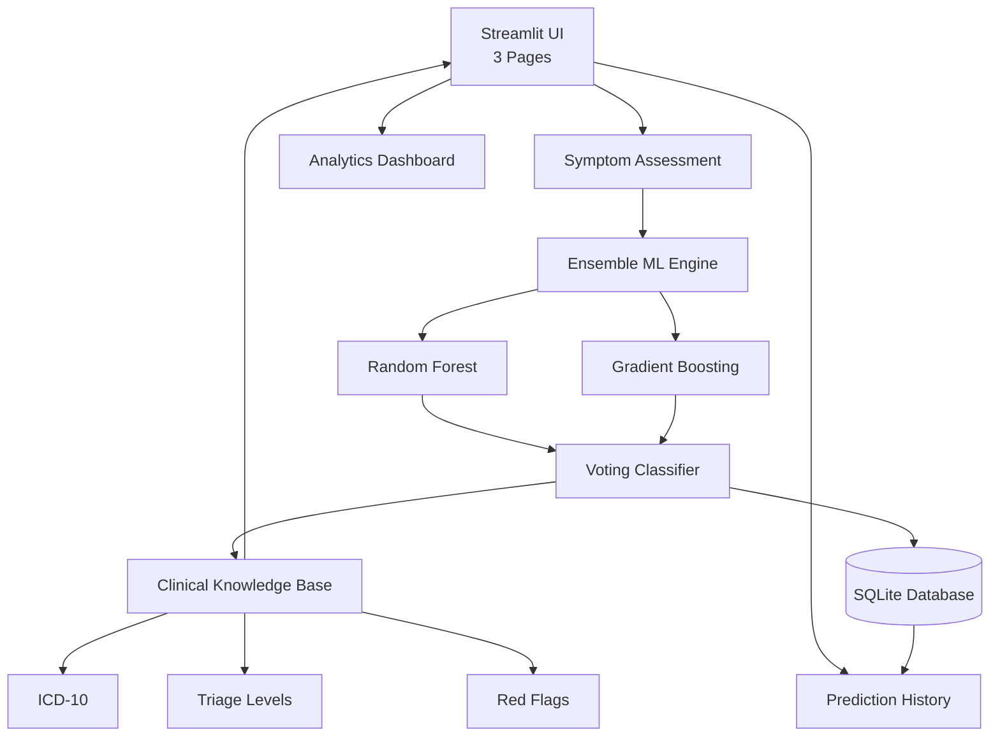

<div align="center">


<br/>


**An end-to-end clinical intelligence platform — symptom input to differential diagnosis with triage scoring, ICD-10 codes, SQLite logging, and a real-time analytics dashboard.**

[View Source](https://github.com/aryana-02/Disease-Prediction-Model) · [Report Bug](https://github.com/aryana-02/Disease-Prediction-Model/issues)

</div>

---

## What Is ClinIQ?

ClinIQ is a **full-stack clinical decision support system** built entirely in Python. A clinician (or student) selects symptoms across 11 body systems, and the app returns a ranked differential diagnosis, triage urgency, ICD-10 classification, red flag symptoms, and a persistent prediction history — all inside a polished multi-page Streamlit UI.

This is not a toy notebook. It is a production-style application with a trained ensemble ML model, a relational database layer, and a custom CSS UI — all wired together end to end.

---

### 🛠️ Tech Stack

**Language**


**ML Engine**


**Frontend**


**Database**

## 🏗️ System Architecture


## ✨ Features at a Glance

| 🤖 Ensemble ML | 🚦 Triage System | 🏥 ICD-10 Coded |
|---------------|------------------|----------------|
| RF + GradientBoosting | 4-level urgency classification | Medical coding support |
| VotingClassifier | Critical → Routine | Specialty routing |
| 114 disease classes | Clinical prioritization | Red flags & complications |

| 🗄️ Persistence | 📊 Analytics Dashboard |
|---------------|----------------------|
| SQLite storage | Live KPIs |
| Session tracking | Top conditions |
| Timestamp logs | Symptom frequency |
| CSV export | Triage visualizations |

---
## 🔬 ML Model Deep Dive

The model is a **VotingClassifier** combining two estimators with soft probability averaging:

| Estimator | Config | Weight |
|-----------|--------|--------|
| `RandomForestClassifier` | 200 trees, max_depth=20, balanced class weights, n_jobs=-1 | **3** |
| `GradientBoostingClassifier` | 150 estimators, depth=6, lr=0.08, subsample=0.85 | **2** |

`predict_topn()` runs `predict_proba()` on the full 57-dim symptom vector and returns the top-N `(disease, probability%)` pairs sorted by confidence, covering **114 disease classes**.

---

## 🗄️ Database Schema

```sql
CREATE TABLE predictions (
    id          INTEGER PRIMARY KEY AUTOINCREMENT,
    session_id  TEXT,
    timestamp   TEXT,
    symptoms    TEXT,      -- JSON blob of active symptoms + severity
    top1        TEXT,      -- Primary differential
    top2        TEXT,
    top3        TEXT,
    confidence  REAL,      -- Primary prediction confidence (%)
    triage      TEXT,      -- CRITICAL / URGENT / SEMI-URGENT / ROUTINE
    specialty   TEXT,      -- Routing specialty (e.g. Cardiology)
    icd10       TEXT       -- ICD-10 code of primary Dx
);
```

---

## 📁 Project Structure

```
Disease-Prediction-Model/
│
├── app.py               # Streamlit app — 3 pages, custom CSS, full UI logic (299 lines)
├── model.py             # ML engine — ensemble training + predict_topn()  (97 lines)
├── database.py          # SQLite layer — create_tables, insert, query, stats
├── disease_info.py      # Clinical knowledge — ICD-10, triage, red flags, specialties
├── dataset.csv          # Training data — 57 symptoms × 114 diseases
├── model_cache.pkl      # Serialized trained model (auto-generated via joblib)
├── clinical_predictions.db  # SQLite database (auto-generated on first run)
└── requirements.txt     # Python dependencies
```

---

## 🚀 Getting Started

```bash
# 1. Clone the repository
git clone https://github.com/aryana-02/Disease-Prediction-Model.git
cd Disease-Prediction-Model

# 2. Install dependencies
pip install -r requirements.txt

# 3. Launch the app
streamlit run app.py
```

Open `http://localhost:8501`. The model trains on first launch, caches to `model_cache.pkl` — all subsequent loads are instant.

**Dependencies:** `streamlit` · `pandas` · `numpy` · `scikit-learn` · `joblib`

---

## 💼 Skills Demonstrated

> [!TIP]
> **🧠 Ensemble ML**  
> VotingClassifier with tuned Random Forest and Gradient Boosting models.

> [!NOTE]
> **🗄️ SQL Schema Design**  
> Normalized tables, typed columns, and parameterized queries.

> [!IMPORTANT]
> **🐍 Full-Stack Python**  
> Separation of UI, model, database, and knowledge modules.

> [!TIP]
> **📦 Model Serialization**  
> Joblib caching with force-retrain workflow.

> [!NOTE]
> **📊 Data Aggregation**  
> GROUP BY, COUNT, and analytics queries using SQLite.

> [!IMPORTANT]
> **🎨 UI Engineering**  
> Custom CSS, Google Fonts, and a multi-page Streamlit interface.

---

## ⚠️ Disclaimer

> ClinIQ is built for **educational and portfolio purposes only**. It is not a licensed medical device and should never replace a qualified clinician. All predictions are probabilistic and require clinical validation.

---

## 👩‍💻 Author

**Aryana Sharma** — B.Tech CSE (Health Informatics), VIT Bhopal

[](https://www.linkedin.com/in/aryana-sharma-284141407)
[](https://github.com/aryana-02)

---

<div align="center">

</div>
